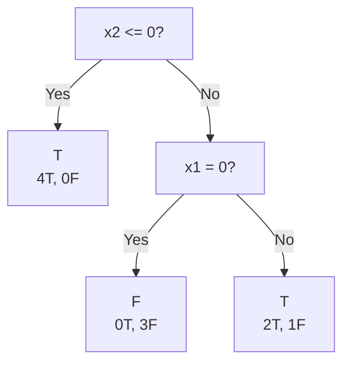

Fiona Spencer
501116950
October 1st, 2026
## Training Data

| x1 | x2 | y |
|---:|---:|:--:|
| 0 | 0 | T |
| 0 | 0 | T |
| 1 | 0 | T |
| 1 | 0 | T |
| 0 | 1 | F |
| 0 | 1 | F |
| 1 | 1 | T |
| 1 | 2 | T |
| 0 | 2 | F |
| 1 | 2 | F |

---

Q1 - *What is the entropy of this collection of training examples with respect to the target class?*

T = 6
F = 4
Total = 10
$$
Entropy(t)=-\sum_{i=0}^{c-1} p_i(t)\log_2 p_i(t)
$$
Where:
	$i$ = class
	$t$ = current node
	$p_i(t)$ = proportion of node that belong to a class

For this dataset:

$$
p_T(t)=\frac{6}{10}=0.6,\qquad
p_F(t)=\frac{4}{10}=0.4
$$
$$
Entropy(t)
=
-\left[
(0.6)\log_2(0.6)
+
(0.4)\log_2(0.4)
\right]
$$
$$
(0.4)\log_2(0.4)
=
(0.4)(-1.322)
\approx -0.529
$$
$$
\boxed{Entropy(t)\approx0.971}
$$

$\therefore$ The entropy of the training examples with respective to the target class is $\approx 0.971$

---

Q2- _What are the different options for the first split when constructing your decision tree?_

Since `x1` is binary and `x2` is ordinal with `0 < 1 < 2`, the possible binary splits are:

`x1 = 0` vs. `x1 = 1`
`x2 <= 0` vs. `x2 > 0`
`x2 <= 1` vs. `x2 > 1`

---
Q3 - _For each potential first split option, compute the information gain._
$$
Gain_{split}
=
Entropy(p)
-
\sum_{i=1}^{k}
\frac{n_i}{n}
Entropy(i)
$$
where:
	$p$ = parent node
	$k$ = number of child nodes
	$n_i$ = number of records in child $i$
	$n$ = number of records in the parent node

Root node:
$$
Entropy(p)=0.971
$$

### Split on `x1`

The split creates two children of size 5 and 5:

$$
Entropy_{split}
=
\frac{5}{10}(0.971)
+
\frac{5}{10}(0.722)
$$

$$
Entropy_{split}
=
0.846
$$

Therefore:

$$
Gain_{x1}
=
0.971-0.846
=
\boxed{0.125}
$$

### Split on `x2 <= 0`

The split creates children of size 4 and 6:

$$
Entropy_{split}
=
\frac{4}{10}(0)
+
\frac{6}{10}(0.918)
$$

$$
Entropy_{split}
=
0.551
$$

Therefore:

$$
Gain_{x2\le0}
=
0.971-0.551
=
\boxed{0.420}
$$

### Split on `x2 <= 1`

The split creates children of size 7 and 3:

$$
Entropy_{split}
=
\frac{7}{10}(0.863)
+
\frac{3}{10}(0.918)
$$

$$
Entropy_{split}
=
0.880
$$

Therefore:

$$
Gain_{x2\le1}
=
0.971-0.880
=
\boxed{0.091}
$$

| Split | Information Gain |
|---|---:|
| `x1` | `0.125` |
| `x2 <= 0` | **`0.420`** |
| `x2 <= 1` | `0.091` |

---
Q4 - _Build the complete decision tree based on the given specifications and training set_.

Tree building requirements:

![[Pasted image 20260925182255.png|600]]

`x2 <= 0` is chosen as the root because it has the largest information gain, `0.420`, so it produces the greatest reduction in uncertainty.

- For `x2 <= 0`, there are 4 training instances and all are `T` (`T=4, F=0`). Since the node is pure and also has fewer than 6 instances, it becomes a leaf predicting `T`.

- For `x2 > 0`, there are 6 training instances (`T=2, F=4`). Because the node has at least 6 instances, it is allowed to split again.

- The attribute `x2` has already been used on this root-to-leaf path, so it cannot be used again. The remaining attribute is `x1`, so the node is split on `x1`.

- For `x1 = 0`, the 3 instances are all `F` (`T=0, F=3`), so this becomes a leaf predicting `F`.

- For `x1 = 1`, there are 3 instances (`T=2, F=1`). Since fewer than 6 instances remain, the node cannot be split further, so the majority class is used and the leaf predicts `T`.

