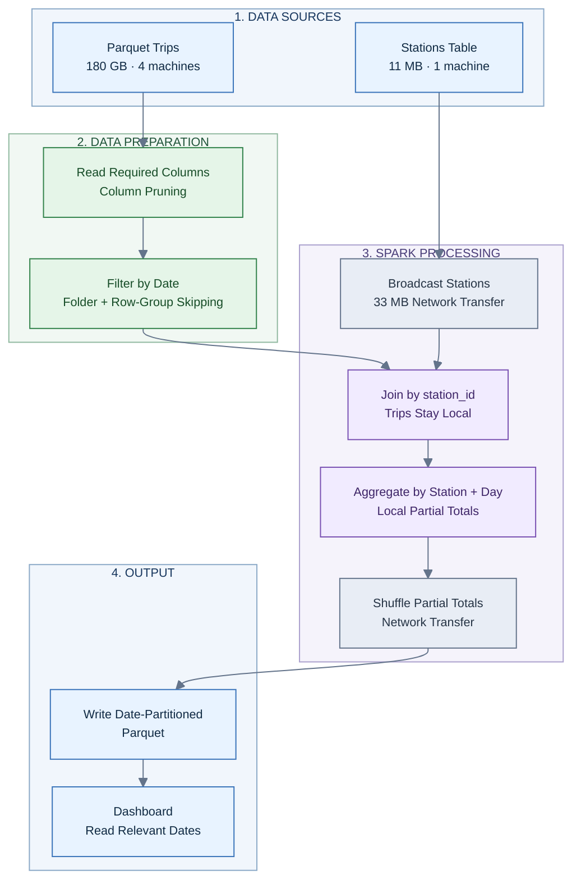

# CPS 853 — Creating Big Data Systems

## Fall 2026 — Take-Home Midterm

| Field              | Information                         |
| ------------------ | ----------------------------------- |
| **Name**           | Fiona Spencer                       |
| **Student Number** | 501116950                           |
| **Section**        | 021                                 |
| **Course**         | CPS 853 — Creating Big Data Systems |
| **Assignment**     | Take-Home Midterm                   |
| **Date**           | October 9, 2026                     |

### AI Acknowledgement

**AI Tool:** ChatGPT (OpenAI)

**Usage:** Used to assist with Markdown and LaTeX formatting, explain concepts, derive calculations, and review written answers. All answers and calculations were reviewed for understanding and accuracy.

---

## Personalized Values

The assignment uses the final two digits of my student number, **501116950**, to determine three values.

| Variable | Definition | Value |
|---|---|---|
| $a$ | Last digit of student number | 0 |
| $b$ | Second-to-last digit | 5 |
| $c$ | Last two digits as one number | 50 |

$$
\boxed{a=0,\quad b=5,\quad c=50}
$$

All calculations use decimal units:

$$
\begin{aligned}
1\text{ MB} &= 10^6\text{ bytes}\\
1\text{ GB} &= 10^9\text{ bytes}\\
1\text{ TB} &= 10^{12}\text{ bytes}
\end{aligned}
$$

HDFS block size:

$$
B=128\text{ MB}
$$

---

# Question 1 — How Big, and How Long to Read?

**Given:**

A ride-hailing company stores ten years of trip records, where the number of records is:

$$
N=(40+c)\times100{,}000{,}000
$$

Substituting $c=50$:

$$
N=(40+50)\times100{,}000{,}000
$$

$$
\boxed{N=9{,}000{,}000{,}000\text{ records}}
$$

Each record occupies 120 bytes in CSV format.

## Q1(a) — CSV Size in GB and TB

**Formula:**

$$
S_{\text{bytes}}=N\times120
$$

Substituting the number of records:

$$
S_{\text{bytes}}=9{,}000{,}000{,}000\times120
$$

$$
S_{\text{bytes}}=1{,}080{,}000{,}000{,}000\text{ bytes}
$$

**Convert to GB:**

$$
S_{\text{GB}}=\frac{1{,}080{,}000{,}000{,}000}{10^9}
$$

$$
\boxed{S_{\text{GB}}=1{,}080\text{ GB}}
$$

**Convert to TB:**

$$
S_{\text{TB}}=\frac{1{,}080}{1000}
$$

$$
\boxed{S_{\text{TB}}=1.08\text{ TB}}
$$

**Final answer:**

- CSV size: **1,080 GB**
- CSV size: **1.08 TB**

## Q1(b) — HDFS Blocks and Total Disk Usage

**Given:**

- HDFS block size: 128 MB
- Default HDFS replication factor: 3
- CSV size from Q1(a): 1,080 GB

### Number of HDFS Blocks

Convert the CSV size into MB:

$$
S_{\text{MB}}=1{,}080\times1{,}000
$$

$$
S_{\text{MB}}=1{,}080{,}000\text{ MB}
$$

Divide by the HDFS block size, rounding up:

$$
N_{\text{blocks}}=
\left\lceil\frac{S_{\text{MB}}}{128}\right\rceil
$$

$$
N_{\text{blocks}}=
\left\lceil\frac{1{,}080{,}000}{128}\right\rceil
$$

$$
N_{\text{blocks}}=\lceil8{,}437.5\rceil
$$

$$
\boxed{N_{\text{blocks}}=8{,}438}
$$

### Total Disk Usage

HDFS stores three copies of the data under its default replication policy.

$$
D_{\text{total}}=3\times S_{\text{GB}}
$$

$$
D_{\text{total}}=3\times1{,}080
$$

$$
\boxed{D_{\text{total}}=3{,}240\text{ GB}}
$$

Convert to TB:

$$
D_{\text{TB}}=\frac{3{,}240}{1{,}000}
$$

$$
\boxed{D_{\text{TB}}=3.24\text{ TB}}
$$

**Final answer:**

- Logical HDFS blocks: **8,438**
- Total replicated disk usage: **3,240 GB (3.24 TB)**

*Note: Disk usage is the nominal replicated data size, excluding filesystem metadata and storage overhead.*

## Q1(c) — Reading Time

**Given:**

- Read speed per machine: 200 MB/s
- Total CSV size: 1,080,000 MB
- Number of parallel machines: 20

### One Machine

Reading time is calculated by dividing the data size by the transfer speed:

$$
T=\frac{\text{Data size}}{\text{Read speed}}
$$

$$
T_1=\frac{1{,}080{,}000}{200}
$$

$$
\boxed{T_1=5{,}400\text{ seconds}}
$$

Convert to minutes:

$$
T_1=\frac{5{,}400}{60}
$$

$$
\boxed{T_1=90\text{ minutes}}
$$

Convert to hours:

$$
T_1=\frac{90}{60}
$$

$$
\boxed{T_1=1.5\text{ hours}}
$$

### Twenty Machines

Assuming the data is distributed equally and all machines read simultaneously at the same speed:

$$
T_{20}=\frac{T_1}{20}
$$

$$
T_{20}=\frac{5{,}400}{20}
$$

$$
\boxed{T_{20}=270\text{ seconds}}
$$

Convert to minutes:

$$
T_{20}=\frac{270}{60}
$$

$$
\boxed{T_{20}=4.5\text{ minutes}}
$$

**Final answer:**

- One machine: **5,400 seconds (90 minutes)**
- Twenty machines: **270 seconds (4.5 minutes)**

The theoretical reading time decreases by a factor of 20 when 20 machines process equal portions of the data in parallel.

## Q1(d) — Why the Actual Time Will Be Longer

The theoretical calculation assumes that every machine continuously reads at 200 MB/s without additional overhead.

In practice, some HDFS blocks may need to be transferred over the network when they are not stored locally on the machine processing them. Network transfers introduce additional latency and consume shared network bandwidth, increasing the total execution time beyond the theoretical estimate.

---

# Question 2 — Choosing a Layout

**Given:**

The trips table contains:

$$
k=10+a
$$

Substituting $a=0$:

$$
k=10+0
$$

$$
\boxed{k=10\text{ columns}}
$$

The monthly report requires only two columns.

## Q2(a) — Fraction of Bytes Read

### Row-Oriented Layout (CSV)

CSV is a row-oriented format. All columns are stored together within each record.

Even when a query needs only two columns, the reader typically scans the complete rows.

Therefore, the approximate fraction of bytes read is:

$$
f_{\text{CSV}}=\frac{k}{k}
$$

$$
f_{\text{CSV}}=\frac{10}{10}=1
$$

$$
\boxed{f_{\text{CSV}}=100\%}
$$

### Column-Oriented Layout (Parquet)

Parquet stores data by column, allowing a query to read only the columns it requires.

Since the monthly report needs two out of ten columns:

$$
f_{\text{Parquet}}=\frac{2}{k}
$$

Substituting $k=10$:

$$
f_{\text{Parquet}}=\frac{2}{10}
$$

$$
f_{\text{Parquet}}=0.2
$$

As a percentage:

$$
f_{\text{Parquet}}=0.2\times100
$$

$$
\boxed{f_{\text{Parquet}}=20\%}
$$

### Comparison

| Layout | Fraction Read | Percentage |
|---|---|---|
| CSV | $10/10$ | 100% |
| Parquet | $2/10$ | 20% |

Under the assumption that all columns have approximately equal width, Parquet reads roughly one-fifth as much data as CSV.

$$
\text{Reduction}=\frac{100-20}{100}\times100
$$

$$
\boxed{\text{Reduction}=80\%}
$$

**Final answer:**

- CSV reads approximately **100%** of the data.
- Parquet reads approximately **20%** of the data.
- Parquet reduces the bytes read by approximately **80%**.

Actual I/O savings also depend on compression and file metadata.

## Q2(b) — Choosing Data Formats

### (i) Monthly Report

**Selected format: Apache Parquet**

Parquet is a column-oriented format that is well suited for analytical queries. Since the monthly report requires only two columns, Parquet can avoid reading unnecessary columns, reducing disk I/O and improving query performance.

### (ii) Phone App Sending Ride Requests

**Selected format: JSON**

JSON is suitable for transmitting individual ride-request events from a mobile application to a server. It is lightweight for small messages, human-readable, and widely supported by web APIs.

### (iii) Teams Sharing Records with Changing Fields

**Selected format: Apache Avro**

Avro is suitable for exchanging complete trip records because it is a row-oriented serialization format with explicit schemas. It supports schema evolution, allowing new fields to be introduced while maintaining compatibility between producers and consumers when appropriate schema-evolution rules are followed.

### Summary

| Scenario | Format | Main Reason |
|---|---|---|
| Monthly analytical report | Parquet | Efficient column reads |
| Individual phone-app events | JSON | Simple API data exchange |
| Full records with changing schema | Avro | Schema evolution |

## Q2(c) — Parquet Row-Group Skipping

Parquet stores statistical metadata for each row group, including the minimum and maximum values of columns such as trip date.

This metadata can be used to avoid reading row groups that cannot satisfy a query's filter.

### When Can Row Groups Be Skipped?

A row group can be skipped when its minimum and maximum dates do not overlap the requested date range.

For example, suppose a query requests trips from March 2026:

- Query start: March 1, 2026
- Query end: March 31, 2026

A row group containing only January 2026 records can be skipped because its date range does not overlap the query.

For a requested range $[q_{\min},q_{\max}]$, a row group can be skipped if:

$$
\boxed{RG_{\max}<q_{\min}}
$$

or:

$$
\boxed{RG_{\min}>q_{\max}}
$$

where:

- $RG_{\min}$: Minimum date stored in the row group
- $RG_{\max}$: Maximum date stored in the row group
- $q_{\min}$: Query's start date
- $q_{\max}$: Query's end date

### When Does It Skip Nothing?

No row groups can be skipped when every row group's minimum and maximum date range overlaps the query's requested range.

For example, if each row group contains records spanning January to December 2026, a query requesting March 2026 overlaps every row group's stored date range.

Therefore, Parquet must examine all the row groups.

**Final answer:**

Parquet skips row groups when their minimum and maximum date statistics prove that they contain no records matching the requested date range. If every row group's date range overlaps the filter, no row groups can be eliminated using those statistics.

---


# Question 3 — MapReduce by Hand

**Given:**

The program generates 1,000,000 trips, each represented by:

$$
(\text{trip\_id},\text{neighbourhood},\text{fare\_cents},\text{seconds})
$$

Based on my student number, the personalized values are:

$$
\boxed{A=0,\quad B=5}
$$

The fare and trip duration are calculated using:

$$
\text{fare\_cents}=600+(i(37+A)\bmod7400)
$$

$$
\text{seconds}=120+(i(131+B)\bmod3480)
$$

Substituting my values:

$$
\boxed{\text{fare\_cents}=600+(37i\bmod7400)}
$$

$$
\boxed{\text{seconds}=120+(136i\bmod3480)}
$$

A trip is considered long when its duration is at least 1,800 seconds:

$$
\boxed{\text{seconds}\geq1800}
$$

## Q3 — Python Implementation

The following program implements the three MapReduce operations using Python's standard library.

```python
A = 0   # Last digit
B = 5   # Second-to-last digit

HOODS = ["Downtown", "Scarborough", "Etobicoke", "North York", "East York"]

def make_trips():
    trips = []
    for trip_id in range(1_000_000):
        hood = HOODS[trip_id % 5]
        fare_cents = 600 + (trip_id * (37 + A)) % 7400
        seconds = 120 + (trip_id * (131 + B)) % 3480
        trips.append((trip_id, hood, fare_cents, seconds))
    return trips


def map_step(trip):
    trip_id, hood, fare_cents, seconds = trip
    return [(hood, fare_cents)] if seconds >= 1800 else []


def shuffle_step(pairs):
    reducers = [[], [], []]
    for hood, fare_cents in pairs:
        reducer_id = HOODS.index(hood) % 3
        reducers[reducer_id].append((hood, fare_cents))
    return reducers


def reduce_step(pairs):
    totals = {}
    for hood, fare_cents in pairs:
        count, cents = totals.get(hood, (0, 0))
        totals[hood] = (count + 1, cents + fare_cents)
    return totals


pairs = []
for trip in make_trips():
    pairs.extend(map_step(trip))

reducers = shuffle_step(pairs)

for r, received in enumerate(reducers):
    print("reducer", r, "received", len(received), "pairs")
    for hood, (count, cents) in reduce_step(received).items():
        print(f"  {hood}: {count} long trips, ${cents / 100:,.2f}")
```

### Explanation of the Three Functions

**1. Map Step**

The `map_step()` function checks whether each trip lasts at least 1,800 seconds. Long trips produce a `(neighbourhood, fare)` pair, while shorter trips are excluded by returning an empty list.

**2. Shuffle Step**

The `shuffle_step()` function assigns each pair to one of three reducers using the neighbourhood's index in `HOODS`, modulo 3:

$$
\boxed{r=\text{HOODS.index(hood)}\bmod3}
$$

The resulting assignments are:

| Neighbourhood | Index | Reducer |
|---|---:|---:|
| Downtown | 0 | 0 |
| Scarborough | 1 | 1 |
| Etobicoke | 2 | 2 |
| North York | 3 | 0 |
| East York | 4 | 1 |

**3. Reduce Step**

The `reduce_step()` function aggregates the pairs received by a reducer. For each neighbourhood, it counts the number of long trips and sums their fares in cents.

---

## Q3 — Program Results

Running the completed program with $A=0$ and $B=5$ produces the following output:

```text
reducer 0 received 206895 pairs
  North York: 103446 long trips, $4,467,274.81
  Downtown: 103449 long trips, $4,352,534.35

reducer 1 received 206895 pairs
  East York: 103447 long trips, $4,505,438.91
  Scarborough: 103448 long trips, $4,391,002.06

reducer 2 received 103446 pairs
  Etobicoke: 103446 long trips, $4,429,236.59
```

*The order of neighbourhoods within each reducer does not affect the results.*

### Neighbourhood Summary

| Neighbourhood | Long Trips | Total Fare |
|---|---:|---:|
| Downtown | 103,449 | $4,352,534.35 |
| Scarborough | 103,448 | $4,391,002.06 |
| Etobicoke | 103,446 | $4,429,236.59 |
| North York | 103,446 | $4,467,274.81 |
| East York | 103,447 | $4,505,438.91 |

### Reducer Summary

| Reducer | Neighbourhoods | Pairs Received |
|---|---|---:|
| 0 | Downtown, North York | 206,895 |
| 1 | Scarborough, East York | 206,895 |
| 2 | Etobicoke | 103,446 |

---

## Q3(a) — Network Communication in MapReduce

In a real MapReduce cluster, the **shuffle step** sends data across the network because the intermediate key-value pairs must be transferred from mappers to the reducers responsible for their neighbourhoods.

The map step can process input data locally on the machines storing it, while the reduce step aggregates the pairs already received by each reducer. Therefore, neither step inherently requires transferring the entire dataset across the network.

## Q3(b) — Reducer Imbalance and Execution Time

**Reducer 2** receives the fewest pairs (103,446), compared with 206,895 pairs each for reducers 0 and 1. This occurs because the modulo-based partitioning assigns only Etobicoke to reducer 2, while the other reducers each handle two neighbourhoods.

This imbalance can cause reducer 2 to finish earlier, leaving it idle while the others continue processing. Since the entire MapReduce job must wait for its slowest reducer, the uneven workload can increase the overall completion time.


# Question 4 — Reading a Spark Job

**Given:**

My student number is 501116950, so:

$$
a=0
$$

Since $a$ is even, I must remove line 6 (`totals.cache()`) from the original Spark program.

Therefore, my version executes **without caching**.

## Spark Program

```python
trips  = sc.textFile("trips.csv")                 # line 1
rows   = trips.map(parse)                         # line 2
longs  = rows.filter(lambda r: r.seconds >= 1800) # line 3
pairs  = longs.map(lambda r: (r.hood, r.fare))    # line 4
totals = pairs.reduceByKey(lambda x, y: x + y)    # line 5

print(totals.count())                             # line 7
print(totals.collect())                           # line 8
```

## Q4(a) — Lazy Evaluation and Actions

When the program reaches where line 6 was originally located, **zero rows** of `trips.csv` have been read.

This is because Spark uses **lazy evaluation**. Transformations such as `map()`, `filter()`, and `reduceByKey()` build a computation plan without immediately processing the data.

The data is processed only when an action is executed.

In this program, the actions are:

- **Line 7 — `totals.count()`**: Triggers execution and counts the number of neighbourhood totals.
- **Line 8 — `totals.collect()`**: Triggers execution and returns the neighbourhood totals to the driver.

**Final answer:**

$$
\boxed{\text{Rows read before the first action}=0}
$$

The actions occur on **lines 7 and 8**.

## Q4(b) — Spark Stages and Shuffle Boundary

The job triggered by line 7 consists of **two stages**.

**Stage 1 — Reading, Mapping, Filtering and Partial Aggregation**

Spark reads the CSV, parses the records, filters trips lasting at least 1,800 seconds, and maps the remaining trips into `(neighbourhood, fare)` pairs.

The `reduceByKey()` operation can also perform local partial aggregation before transferring data between machines.

**Stage 2 — Shuffle and Final Aggregation**

Spark redistributes the intermediate key-value pairs by neighbourhood so that values belonging to the same key can be combined.

The final aggregation then produces the total fare for each neighbourhood.

The stage boundary occurs at **line 5**, where `reduceByKey()` requires a shuffle.

A shuffle is necessary because records with the same neighbourhood may be distributed across multiple partitions or machines.

**Final answer:**

$$
\boxed{\text{Number of stages}=2}
$$

$$
\boxed{\text{Shuffle boundary}=\text{Line 5}}
$$

The boundary exists because `reduceByKey()` must redistribute data by key before completing the aggregation.

## Q4(c) — Execution of Line 8 Without Caching

Since my version removes `totals.cache()` (line 6), Spark does not persist the computed RDD for reuse between actions.

When line 7 executes `totals.count()`, Spark triggers the first job, evaluating the RDD transformations and calculating the number of neighbourhood totals.

When line 8 executes `totals.collect()`, Spark triggers a second job that recomputes the results and returns the neighbourhood totals to the driver.

Because the RDD was not cached, Spark must **reevaluate its lineage**, which consists of the following operations:

1. **Line 1 — `sc.textFile()`:** Read the CSV input data again.
2. **Line 2 — `map()`:** Parse the trip records again.
3. **Line 3 — `filter()`:** Filter trips lasting at least 1,800 seconds again.
4. **Line 4 — `map()`:** Generate the `(neighbourhood, fare)` key-value pairs again.
5. **Line 5 — `reduceByKey()`:** Repeat the key-based aggregation, including the required shuffle.

These operations are reevaluated as part of Spark's execution plan; the Python statements defining the RDDs are not executed again.

The `collect()` action then transfers the final aggregated results from the worker machines to the driver for printing.

### Final Answer

Without caching, **line 8 triggers a new Spark job that reevaluates the RDD lineage from the original input**, repeating the transformations and shuffle associated with lines 1–5. This occurs because the results computed during line 7 were not persisted for reuse.

---

# Question 5 — Design a Join

**Given:**

The nightly pipeline joins a Parquet trips dataset with a stations table, then calculates the total per station per day.

From Question 1(a), the original CSV size is:

$$
S_{\text{CSV}}=1080\text{ GB}
$$

The Parquet dataset occupies one-sixth of the CSV size.

The stations table size and number of machines depend on my student number:

$$
a=0,\qquad c=50
$$

### Parquet Dataset Size

$$
S_{\text{Parquet}}=\frac{S_{\text{CSV}}}{6}
$$

$$
S_{\text{Parquet}}=\frac{1080}{6}
$$

$$
\boxed{S_{\text{Parquet}}=180\text{ GB}}
$$

Converting to MB:

$$
180\times1000=180{,}000\text{ MB}
$$

### Stations Table Size

$$
X=1+\frac{c}{5}
$$

$$
X=1+\frac{50}{5}
$$

$$
\boxed{X=11\text{ MB}}
$$

### Number of Machines

$$
M=4+a
$$

$$
M=4+0
$$

$$
\boxed{M=4\text{ machines}}
$$

---

## Q5(a) — Spark's Default Join Strategy

Spark uses a default automatic broadcast threshold of 10 MB under the settings specified in the assignment.

A table is eligible for automatic broadcasting when its estimated size is at most 10 MB.

$$
T_{\text{broadcast}}=10\text{ MB}
$$

The stations table occupies:

$$
X=11\text{ MB}
$$

Comparing the sizes:

$$
11\text{ MB}>10\text{ MB}
$$

Therefore, the stations table exceeds the automatic broadcast threshold.

**Final answer:**

Spark will not automatically select a broadcast join because the stations table is 11 MB, exceeding the default 10 MB threshold.

For a normal equi-join between these datasets, Spark would typically select a **shuffle-based sort-merge join** under the assumed default settings.

This requires both datasets to be partitioned by the join key so that matching records can be joined.

---


## Q5(b) — Network Transfer Comparison

Two strategies are considered:

1. Broadcast the stations table to every other machine.
2. Shuffle both datasets by station.

**Given:**

$$
\begin{aligned}
S_{\text{Parquet}} &= 180{,}000\text{ MB}\\
X &= 11\text{ MB}\\
M &= 4\text{ machines}
\end{aligned}
$$

### (i) Broadcasting the Stations Table

The stations table initially exists on one machine. Broadcasting sends a copy to the other three machines, allowing each machine to join its local trips with the stations data.

**Formula:**

$$
D_{\text{broadcast}}=X(M-1)
$$

**Substitution:**

$$
D_{\text{broadcast}}=11\text{ MB}\times(4-1)
$$

$$
D_{\text{broadcast}}=11\times3
$$

**Result:**

$$
\boxed{D_{\text{broadcast}}=33\text{ MB}}
$$

Only **33 MB** crosses the network because the large trips dataset remains distributed across the machines.

### (ii) Shuffling Both Tables

With a shuffle join, both datasets are redistributed according to their station key.

The assignment specifies that, on average, the fraction of each dataset transferred across the network is:

$$
f_{\text{shuffle}}=\frac{M-1}{M}
$$

**Substitution:**

$$
f_{\text{shuffle}}=\frac{4-1}{4}
$$

$$
\boxed{f_{\text{shuffle}}=0.75=75\%}
$$

Therefore, approximately 75% of each dataset must cross the network.

#### Step 1 — Trips Dataset Transfer

**Formula:**

$$
D_{\text{trips}}=f_{\text{shuffle}}\times S_{\text{Parquet}}
$$

**Substitution:**

$$
D_{\text{trips}}=0.75\times180{,}000\text{ MB}
$$

**Result:**

$$
\boxed{D_{\text{trips}}=135{,}000\text{ MB}}
$$

#### Step 2 — Stations Table Transfer

**Formula:**

$$
D_{\text{stations}}=f_{\text{shuffle}}\times X
$$

**Substitution:**

$$
D_{\text{stations}}=0.75\times11\text{ MB}
$$

**Result:**

$$
\boxed{D_{\text{stations}}=8.25\text{ MB}}
$$

#### Step 3 — Total Shuffle Network Transfer

**Formula:**

$$
D_{\text{shuffle}}=D_{\text{trips}}+D_{\text{stations}}
$$

**Substitution:**

$$
D_{\text{shuffle}}=135{,}000+8.25
$$

**Result:**

$$
\boxed{D_{\text{shuffle}}=135{,}008.25\text{ MB}}
$$

Converting to GB:

$$
D_{\text{shuffle}}=\frac{135{,}008.25}{1000}
$$

$$
\boxed{D_{\text{shuffle}}\approx135.01\text{ GB}}
$$

### (iii) Comparing the Two Strategies

| Join Strategy | Network Transfer |
|---|---:|
| Broadcast stations table | 33 MB |
| Shuffle both tables | 135,008.25 MB |

To determine how many times more data the shuffle join transfers:

**Formula:**

$$
R=\frac{D_{\text{shuffle}}}{D_{\text{broadcast}}}
$$

**Substitution:**

$$
R=\frac{135{,}008.25\text{ MB}}{33\text{ MB}}
$$

**Result:**

$$
\boxed{R\approx4{,}091.16}
$$

The ratio is dimensionless because both quantities are measured in MB.

### Final Answer

Broadcasting the stations table is the more network-efficient strategy.

- **Broadcast join:** 33 MB transferred.
- **Shuffle join:** 135,008.25 MB transferred.
- **Difference:** Approximately 4,091 times more data is transferred by the shuffle join.

Although the 11 MB stations table exceeds Spark's default 10 MB automatic broadcast threshold, explicitly broadcasting it would substantially reduce network traffic compared with shuffling both datasets.

Therefore, I would use an **explicit broadcast join**, assuming the stations table can fit comfortably in memory on each machine.


---

## Q5(c) — Nightly Data Processing Pipeline

The nightly pipeline reads the Parquet trips dataset, filters the required data, joins trips with station information, and aggregates total fares per station per day.

The output is stored as date-partitioned Parquet files for dashboard queries.

The recommended strategy is an **explicit broadcast join**, since Q5(b) showed that broadcasting the stations table transfers substantially less data than shuffling both datasets.

### Pipeline Diagram



### Explanation of the Pipeline

**1. Read Parquet Trips**

The trips dataset contains 180 GB of Parquet data distributed across four machines.

Spark reads only the columns required for filtering, joining, and aggregation.

This optimization is called **column pruning** and reduces unnecessary disk I/O by avoiding columns that are not needed.

**2. Filter by Date**

Spark filters the trips to the dates required for nightly processing.

Two optimizations can reduce disk reads:

- **Partition pruning:** If the input is partitioned by date, Spark can skip irrelevant date folders.
- **Row-group skipping:** Parquet's minimum and maximum date statistics allow Spark to skip row groups that cannot contain matching records.

These optimizations reduce the amount of input data read before the join.

**3. Broadcast the Stations Table**

The stations table is 11 MB and initially resides on one machine.

The table is broadcast to the other three machines.

**Formula:**

$$
D_{\text{broadcast}}=X(M-1)
$$

**Substitution:**

$$
D_{\text{broadcast}}=11\text{ MB}\times(4-1)
$$

**Result:**

$$
\boxed{D_{\text{broadcast}}=33\text{ MB}}
$$

This transfer allows each machine to join its local trips with the stations information without redistributing the large trips dataset for the join.

**4. Join Trips with Stations**

Each machine performs the join using its local trips and the broadcast stations table.

The join uses `station_id` as the key and produces records containing the station and trip information needed for the daily totals.

Because the stations table is available on each machine, the trips dataset does not require a network shuffle for the join.

**5. Aggregate by Station and Day**

Spark groups the joined trips by `station_id` and `date` to calculate total daily fares.

Local partial aggregation can reduce the number of values transferred.

However, combining partial totals from different machines generally requires a **shuffle across the network**.

This aggregation shuffle is separate from the 33 MB broadcast transfer estimated in Q5(b).

**6. Write Date-Partitioned Parquet Output**

The aggregated results are written as Parquet files partitioned by date.

For example:

```text
dashboard_totals/
  date=2026-10-01/
    part-00000.parquet
  date=2026-10-02/
    part-00000.parquet
  date=2026-10-03/
    part-00000.parquet
```

Date partitioning allows the dashboard to read only relevant date folders instead of scanning the entire output dataset.

### Default Join vs. Recommended Join

In Q5(a), the stations table exceeds Spark's default automatic broadcast threshold:

$$
11\text{ MB}>10\text{ MB}
$$

Therefore, Spark would not automatically choose a broadcast join under the assignment's specified default settings.

However, Q5(b) shows that broadcasting the stations table requires much less network transfer:

| Strategy | Join Network Transfer |
|---|---:|
| Broadcast join | 33 MB |
| Shuffle join | 135,008.25 MB |

The ratio is:

$$
R=\frac{135{,}008.25\text{ MB}}{33\text{ MB}}
$$

$$
\boxed{R\approx4091.16}
$$

Therefore, I would explicitly request a broadcast join using Spark's `broadcast()` function:

```python
from pyspark.sql.functions import broadcast, sum

daily_totals = (
    filtered_trips
    .join(broadcast(stations), "station_id")
    .groupBy("station_id", "date")
    .agg(sum("fare").alias("total_fare"))
)

daily_totals.write \
    .mode("overwrite") \
    .partitionBy("date") \
    .parquet("dashboard_totals")
```

This allows Spark to use the network-efficient broadcast strategy, assuming the stations table fits in memory.

### Final Answer

The recommended nightly pipeline reads the required Parquet columns, skips irrelevant date folders and row groups when possible, and broadcasts the 11 MB stations table to the other three machines.

The broadcast join transfers approximately **33 MB**, compared with **135,008.25 MB** for shuffling both input tables, making it approximately **4,091 times more network-efficient** under the assignment's assumptions.

Spark then aggregates fares by station and day, performing an additional aggregation shuffle when necessary, and writes the results as date-partitioned Parquet files for efficient dashboard access.
