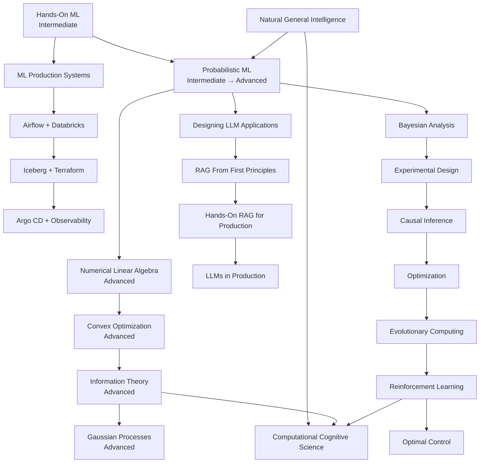

---

# Phase overview

|Phase|Focus|Core progression|
|--:|---|---|
|**1**|Strong ML base|Hands-On ML → Probabilistic ML|
|**2**|Data & analytics engineering|SQL/Data Modeling → dbt → Airflow → Spark → Databricks → Iceberg/Delta|
|**3**|Cloud & infrastructure|AWS → Docker → Terraform → Kubernetes → Helm → Argo CD → Observability|
|**4**|Production ML|ML Production Systems → ML Platform Engineering → MLflow → Feature Stores|
|**5**|Mathematical depth|Numerical Linear Algebra → Convex Optimization → Information Theory → Gaussian Processes|
|**6**|Modern AI / RAG|LLM Applications → RAG First Principles → Production RAG → FastAPI → LLMOps|
|**7**|Research intelligence|Bayesian Methods → Experimental Design → Causal Inference → Optimization → RL → Optimal Control|
|**8**|Cognitive AI|Natural General Intelligence → Computational Cognitive Science|

---

# 1. ML research foundation

|#|Textbook|Level|Context|Link|
|--:|---|---|---|---|
|1|**Hands-On Machine Learning with Scikit-Learn and PyTorch**|Intermediate|Classification, ensembles, PyTorch, practical ML|[O’Reilly](https://www.oreilly.com/library/view/hands-on-machine-learning/9798341607972/)|
|2|**Probabilistic Machine Learning: An Introduction — Kevin Murphy**|Intermediate → Advanced|Probability, Bayesian ML, probabilistic models|[MIT Press](https://mitpress.ublish.com/book/probabilistic-machine-learning-an-introduction)|
|3|**Numerical Linear Algebra — Trefethen & Bau**|Advanced|SVD, QR, eigenvalues, numerical stability|[Official page](https://people.maths.ox.ac.uk/trefethen/text.html)|
|4|**Convex Optimization — Boyd & Vandenberghe**|Advanced|Constraints, duality, convex optimization|[Free official book](https://web.stanford.edu/~boyd/cvxbook/)|
|5|**Elements of Information Theory — Cover & Thomas**|Advanced|Entropy, KL divergence, mutual information|[Wiley](https://onlinelibrary.wiley.com/doi/book/10.1002/047174882X)|
|6|**Gaussian Processes for Machine Learning**|Advanced|Bayesian prediction, kernels, uncertainty|[Free MIT Press edition](https://direct.mit.edu/books/oa-monograph/2320/Gaussian-Processes-for-Machine-Learning)|

**Flow:**  
**Hands-On ML → Probabilistic ML → Numerical Linear Algebra → Convex Optimization → Information Theory → Gaussian Processes**

---

# 2. Data modeling & analytics engineering

|#|Textbook|Level|Context|Link|
|--:|---|---|---|---|
|1|**Analytics Engineering with SQL and dbt**|Intermediate|dbt, SQL models, testing, analytics engineering|[O’Reilly](https://www.oreilly.com/library/view/analytics-engineering-with/9781098142377/)|
|2|**Data Modeling with Microsoft Power BI**|Intermediate|Star schemas, dimensions, relationships|[O’Reilly](https://www.oreilly.com/library/view/data-modeling-with/9781098148546/)|
|3|**Universal Data Modeling**|Intermediate → Advanced|Relational, NoSQL, dimensional, Data Vault|[O’Reilly](https://www.oreilly.com/library/view/universal-data-modeling/0642572229368/)|
|4|**Data Management at Scale, 2nd Ed.**|Intermediate|Data products, governance, enterprise architecture|[O’Reilly](https://www.oreilly.com/library/view/data-management-at/9781098138851/)|
|5|**Fundamentals of Data Engineering**|Intermediate|End-to-end data engineering architecture|[O’Reilly](https://www.oreilly.com/library/view/fundamentals-of-data/9781098108298/)|

### Concepts to learn

**Relational modeling**

- Normalization / denormalization
- Primary and foreign keys
- Transactions
- Indexes
- Query plans
    

**Analytical modeling**

- Fact tables
- Dimension tables
- Star schemas
- Snowflake schemas
- Grain
- Surrogate keys
- Slowly changing dimensions
    

**Modern analytics**

- Semantic layers
- Data contracts
- Schema evolution
- Data lineage
- Data products
- Data Vault
    
### Tool stack

|Area|Tools|
|---|---|
|SQL|PostgreSQL, advanced SQL|
|Transformation|**dbt Core / dbt Cloud**|
|Warehouse|Snowflake, Redshift, Databricks SQL|
|Local analytics|DuckDB, Polars|
|Columnar data|Parquet, PyArrow|
|BI|Power BI / Tableau|
|Data quality|Great Expectations / Soda|
|Lineage|OpenLineage|
|Lakehouse|Iceberg / Delta Lake|

**Flow:**  
**Advanced SQL → Data Modeling → dbt → Analytics Engineering → Airflow → Spark → Databricks**

---

# 3. Data engineering & distributed systems

|#|Textbook|Level|Context|Link|
|--:|---|---|---|---|
|1|**Data Pipelines with Apache Airflow, 2nd Ed.**|Intermediate → Advanced|DAGs, orchestration, scheduling|[O’Reilly](https://www.oreilly.com/library/view/data-pipelines-with/9781633436374/)|
|2|**Databricks Data Intelligence Platform**|Intermediate|Spark, Delta, Unity Catalog, ML|[O’Reilly](https://www.oreilly.com/library/view/databricks-data-intelligence/9798868804441/)|
|3|**Apache Iceberg: The Definitive Guide**|Advanced|Lakehouse tables, metadata, transactions|[O’Reilly](https://www.oreilly.com/library/view/apache-iceberg-the/9781098148614/)|

Also learn:

**Kafka → Spark Structured Streaming → S3 → Parquet → Iceberg/Delta → Databricks**

Important concepts:

- partitions
- consumer groups
- offsets
- delivery semantics
- schema evolution
- streaming vs batch
- event-driven architecture
    
---

# 4. AWS / cloud engineering

## AWS services roadmap

|#|Area|Services|
|--:|---|---|
|1|Identity|IAM, IAM Identity Center|
|2|Security|KMS, Secrets Manager, ACM|
|3|Networking|VPC, Subnets, Route Tables, NAT, Security Groups, Route 53|
|4|Compute|EC2, Auto Scaling, ELB|
|5|Containers|ECR, ECS, Fargate, EKS|
|6|Storage|S3, EBS, EFS, Glacier|
|7|Relational DB|RDS, Aurora|
|8|NoSQL|DynamoDB|
|9|Cache|ElastiCache / Redis|
|10|Serverless|Lambda|
|11|API|API Gateway|
|12|Messaging|SQS, SNS, EventBridge|
|13|Streaming|Kinesis, MSK|
|14|ETL|Glue|
|15|Query|Athena|
|16|Big data|EMR|
|17|Data lake|Lake Formation|
|18|Warehouse|Redshift|
|19|ML|SageMaker|
|20|GenAI|Bedrock|
|21|Monitoring|CloudWatch, X-Ray|
|22|Auditing|CloudTrail, Config|
|23|DevOps|CodeBuild / CodePipeline / GitHub Actions|
|24|IaC|CloudFormation, CDK, Terraform|
|25|Governance|Organizations, Control Tower, SCPs|
|26|Cost|Budgets, Cost Explorer, Compute Optimizer|

### AWS priority for ML/data work

**IAM → VPC → S3 → EC2 → Lambda → SQS/EventBridge → Glue → Athena → EMR → Redshift → Kinesis/MSK → SageMaker → Bedrock → EKS → CloudWatch → Terraform**

---

# 5. AWS certification textbooks

|#|Certification / Book|Level|Context|Link|
|--:|---|---|---|---|
|1|**AWS Certified Solutions Architect – Associate Study Guide**|Intermediate|Broad AWS architecture|[O’Reilly](https://www.oreilly.com/library/view/aws-certified-solutions/9781119982623/)|
|2|**AWS Certified Data Engineer Associate Study Guide**|Intermediate → Advanced|Pipelines, storage, quality, governance|[O’Reilly](https://www.oreilly.com/library/view/aws-certified-data/9781098170066/)|
|3|**AWS Certified Machine Learning Engineer Study Guide**|Intermediate → Advanced|SageMaker, training, deployment, MLOps|[O’Reilly](https://www.oreilly.com/library/view/aws-certified-machine/9781394319954/)|
|4|**AWS Certified Data Engineer Study Guide — Sybex**|Intermediate → Advanced|Deeper DEA-C01 reference|[O’Reilly](https://www.oreilly.com/library/view/aws-certified-data/9781394286584/)|

Recommended certification order:

**Solutions Architect Associate → Data Engineer Associate → Machine Learning Engineer Associate**

---

# 6. Infrastructure & platform engineering

|#|Textbook|Level|Context|Link|
|--:|---|---|---|---|
|1|**Terraform in Depth**|Advanced|Infrastructure as code|[O’Reilly](https://www.oreilly.com/library/view/terraform-in-depth/9781633438002/)|
|2|**Argo CD: Up and Running**|Intermediate → Advanced|Kubernetes GitOps deployments|[O’Reilly](https://www.oreilly.com/library/view/argo-cd-up/9781098141998/)|
|3|**Observability Engineering, 2nd Ed.**|Advanced|Telemetry, SLOs, distributed debugging|[O’Reilly](https://www.oreilly.com/library/view/observability-engineering-2nd/9781098179915/)|
|4|**Mastering API Architecture**|Intermediate → Advanced|Gateways, REST, microservices, service mesh|[O’Reilly](https://www.oreilly.com/library/view/mastering-api-architecture/9781492090625/)|
|5|**Effective Platform Engineering**|Advanced|Internal platforms, self-service infrastructure|[O’Reilly](https://www.oreilly.com/library/view/effective-platform-engineering/9781633436497/)|

### Core tool flow

**Docker → Kubernetes → Helm → Terraform → Argo CD → OpenTelemetry → Prometheus/Grafana**

Also learn:

- Redis
- API gateways
- gRPC
- OAuth/OIDC
- service meshes
- GitHub Actions
- Backstage
- secrets management

---

# 7. Commercial ML engineering

|#|Textbook|Level|Context|Link|
|--:|---|---|---|---|
|1|**Hands-On Machine Learning**|Intermediate|Train and evaluate models|[O’Reilly](https://www.oreilly.com/library/view/hands-on-machine-learning/9798341607972/)|
|2|**Machine Learning Production Systems**|Intermediate → Advanced|Production pipelines and serving|[O’Reilly](https://www.oreilly.com/library/view/machine-learning-production/9781098156008/)|
|3|**Machine Learning Platform Engineering**|Advanced|MLflow, Kubeflow, Feast, Kubernetes|[O’Reilly](https://www.oreilly.com/library/view/machine-learning-platform/9781633437333/)|
|4|**Building Machine Learning Systems with a Feature Store**|Advanced|Features, training, online inference|[O’Reilly](https://www.oreilly.com/library/view/building-machine-learning/9781098165222/)|

Core technologies:

**Scikit-Learn → LightGBM/XGBoost → PyTorch → MLflow → Feast → Docker → Kubernetes → monitoring**

---

# 8. Modern AI / RAG

|#|Textbook|Level|Context|Link|
|--:|---|---|---|---|
|1|**Designing Large Language Model Applications**|Intermediate → Advanced|LLM architecture, embeddings|[O’Reilly](https://www.oreilly.com/library/view/designing-large-language/9781098150495/)|
|2|**RAG from First Principles**|Advanced|Retrieval, chunking, reranking|[O’Reilly](https://www.oreilly.com/library/view/rag-from-first/9781835888667/)|
|3|**Hands-On RAG for Production**|Advanced|Production RAG, GraphRAG, agents|[O’Reilly](https://www.oreilly.com/library/view/hands-on-rag-for/9798341621701/)|
|4|**RAG with Python Cookbook**|Intermediate → Advanced|Practical RAG recipes|[O’Reilly](https://www.oreilly.com/library/view/rag-with-python/9798341600553/)|
|5|**Building Generative AI Services with FastAPI**|Intermediate → Advanced|AI APIs, vector DBs, caching|[O’Reilly](https://www.oreilly.com/library/view/building-generative-ai/9781098160296/)|
|6|**LLMs in Production**|Advanced|LoRA, fine-tuning, serving, LLMOps|[O’Reilly](https://www.oreilly.com/library/view/llms-in-production/9781633437203/)|

Also learn:

- Hugging Face
- Transformers
- PEFT / LoRA
- sentence-transformers
- vector databases
- hybrid search
- rerankers
- vLLM
- llama.cpp
- model evaluation
- agents/tool calling
    
---

# 9. Research & decision intelligence

|#|Textbook|Level|Context|Link|
|--:|---|---|---|---|
|1|**Bayesian Analysis with Python, 3rd Ed.**|Intermediate|Practical Bayesian modeling|[O’Reilly](https://www.oreilly.com/library/view/bayesian-analysis-with/9781805127161/)|
|2|**Design and Analysis of Experiments**|Intermediate → Advanced|A/B testing, factorial designs, ANOVA|[O’Reilly](https://www.oreilly.com/library/view/design-and-analysis/9781119320937/)|
|3|**Causal Inference: The Mixtape**|Intermediate → Advanced|Causal effects and quasi-experiments|[Yale](https://yalebooks.yale.edu/book/9780300251685/causal-inference/)|
|4|**Causal AI**|Advanced|Causal ML/AI|[Official resources](https://www.robertosazuwaness.com/causal-ai-book/)|
|5|**Optimization Algorithms**|Intermediate → Advanced|Search, metaheuristics, optimization|[O’Reilly](https://www.oreilly.com/library/view/optimization-algorithms/9781633438835/)|
|6|**Introduction to Evolutionary Computing**|Advanced|Genetic and evolutionary algorithms|[Springer](https://link.springer.com/book/10.1007/978-3-662-44874-8)|
|7|**Reinforcement Learning: An Introduction**|Advanced|MDPs, Q-learning, policy learning|[Free official book](http://incompleteideas.net/book/the-book-2nd.html)|
|8|**Dynamic Programming and Optimal Control**|Advanced|Sequential decisions and optimal control|[Official resources](https://www.mit.edu/~dimitrib/dpbook.html)|

**Flow:**  
**Bayesian Statistics → Experimental Design → Causality → Optimization → Evolutionary Computing → RL → Optimal Control**

---

# 10. Cognitive / AI research

|#|Textbook / Resource|Level|Context|Link|
|--:|---|---|---|---|
|1|**Natural General Intelligence — Christopher Summerfield**|Intermediate|Brain-inspired AI concepts|[Oxford](https://academic.oup.com/book/45403)|
|2|**Probabilistic Machine Learning**|Intermediate → Advanced|Learning under uncertainty|[MIT Press](https://mitpress.ublish.com/book/probabilistic-machine-learning-an-introduction)|
|3|**Elements of Information Theory**|Advanced|Representation and information|[Wiley](https://onlinelibrary.wiley.com/doi/book/10.1002/047174882X)|
|4|**Reinforcement Learning: An Introduction**|Advanced|Reward-based cognition/decision making|[Free](http://incompleteideas.net/book/the-book-2nd.html)|
|5|**MIT Computational Cognitive Science**|Advanced|Bayesian cognition, concepts, reasoning|[MIT OCW](https://ocw.mit.edu/courses/9-66j-computational-cognitive-science-fall-2004/)|

---

# Complete recommended order

### Stage 1 — Core foundations

**Hands-On ML**  
→ Advanced SQL  
→ Data Modeling  
→ Probabilistic ML

### Stage 2 — Data systems

**dbt**  
→ Airflow  
→ Spark/Hadoop  
→ Kafka  
→ Databricks  
→ Parquet / Iceberg / Delta

### Stage 3 — Cloud

**AWS Solutions Architecture**  
→ IAM/VPC/S3/EC2  
→ Lambda/SQS  
→ Glue/Athena/EMR  
→ Redshift  
→ Data Engineer certification

### Stage 4 — Infrastructure

**Docker**  
→ Terraform  
→ Kubernetes  
→ Helm  
→ Argo CD  
→ OpenTelemetry / Prometheus / Grafana

### Stage 5 — Production ML

**ML Production Systems**  
→ MLflow  
→ Feature Stores  
→ SageMaker  
→ model serving/monitoring

### Stage 6 — Mathematical depth

**Numerical Linear Algebra**  
→ Convex Optimization  
→ Information Theory  
→ Gaussian Processes

### Stage 7 — Modern AI

**LLM Applications**  
→ Embeddings  
→ RAG From First Principles  
→ Production RAG  
→ FastAPI AI Services  
→ LLMOps

### Stage 8 — Research intelligence

**Bayesian Analysis**  
→ Experimental Design  
→ Causal Inference  
→ Optimization  
→ Evolutionary Computing  
→ Reinforcement Learning  
→ Optimal Control

### Stage 9 — Cognitive AI

**Natural General Intelligence**  
→ Computational Cognitive Science

